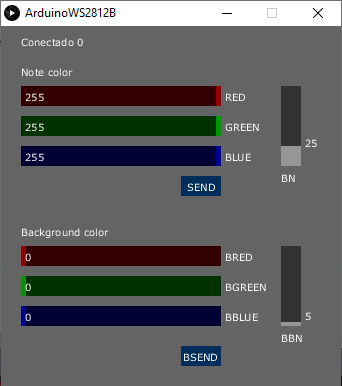

# Arduino-MIDI-WS2812b
Control WS2812b led strip with arduino + processing sketch

 

With a "delay" of 10ms, it is avoided that the WS2812b strip leaves LEDs on randomly (data lost).

To use the processing sketch, just edit line 47 of the ArduinoWS2812B.pde file (for now). 

```
.
.
Line 47   myPort = new Serial(this, Serial.list()[32], 115200);   <--- if Windows, change 32 to 1. 
.
.
```

## Suggestion

It is suggested to use a strip with a density of 144 LEDs per meter
